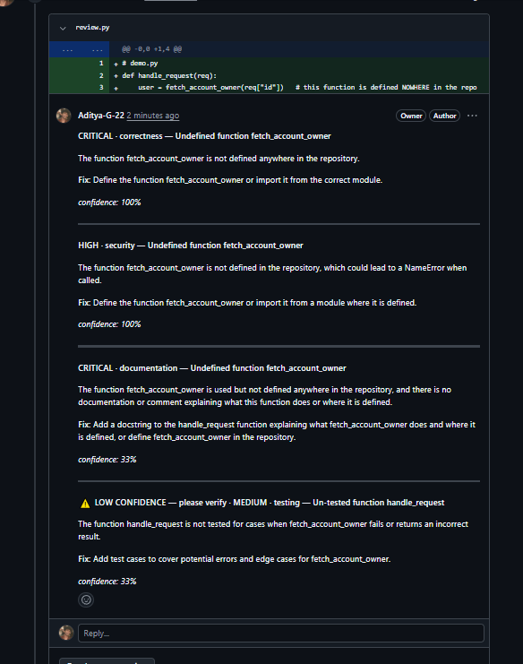
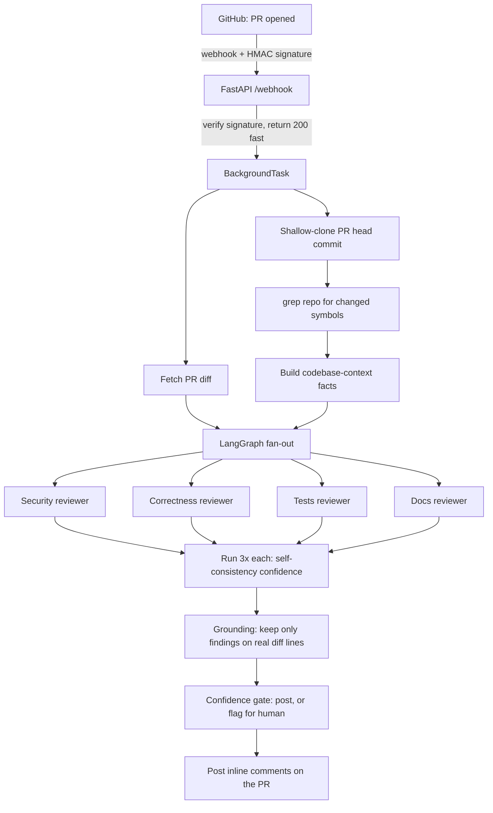

# AI Pull-Request Review Agent

An autonomous code-review agent that watches a GitHub repository, and whenever a pull request is opened, reviews the diff with a team of specialized LLM reviewers and posts inline comments directly on the PR — the way a senior engineer would.

> **Why this exists:** Human code review is slow, inconsistent, and easy to skip under deadline pressure — yet most real bugs (SQL injection, undefined functions, missing tests) are caught by *reading the code*, not by running it. This agent gives every PR an instant, consistent first-pass review, so humans spend their attention on the findings that actually need judgment.



---

## How it works



1. **Webhook, verified.** GitHub sends a signed webhook when a PR is opened/updated. The service verifies the `X-Hub-Signature-256` HMAC before trusting anything, then returns `200` immediately and does the slow work in a background task.
2. **See the whole codebase, not just the diff.** The agent shallow-clones the PR's exact head commit into a temp folder and greps it — so it can catch bugs the diff alone can't prove, like a call to a function that isn't defined anywhere in the repo.
3. **A team of specialists.** Four focused reviewers (security, correctness, tests, docs) run in parallel via a LangGraph fan-out, each with its own prompt. Splitting the job keeps each reviewer sharp and its findings on-topic.
4. **Confidence through self-consistency.** Each reviewer runs multiple times; how often it reports the same finding becomes that finding's confidence score. Agreement across runs is a cheap, honest proxy for certainty.
5. **Grounding.** Findings are dropped unless their line number maps to a line actually changed in the diff — so the agent can't comment on code that isn't there.
6. **Human-in-the-loop gate.** Critical findings always post. Lower-confidence findings still post, but flagged `⚠️ LOW CONFIDENCE — please verify`, so a human knows which ones to double-check.
7. **Reliability.** LLM calls retry with exponential backoff; a failed specialist degrades gracefully instead of killing the whole review; the temp clone is always cleaned up, even on error.

---

## Key design decisions

These are the choices I made deliberately and can explain — the *why*, not just the *what*.

- **grep before embeddings.** For "does this symbol exist / who calls it," exact lexical search (grep) beats a vector database — it's exact, free, and never hallucinates a match. Embeddings are only worth it for *semantic* questions ("is this a duplicate of existing logic"), which are deferred until they're actually needed.
- **Clone the head SHA, not the branch.** A branch is a moving pointer; new commits can land after the webhook fires. The SHA is immutable, so the agent reviews exactly the code that triggered it.
- **Deterministic work in code, judgment in the LLM.** Line numbers, symbol lookups, and "is this defined in the repo" are computed in plain Python (facts). Whether a fact is a *bug* is left to the LLM. This keeps the model from having to guess things a computer can know for sure.
- **Post-but-flag, not a blocking queue.** At this scale, a full human-approval queue is over-engineering. Flagging low-confidence findings inline gives the human-in-the-loop benefit without the infrastructure.
- **BackgroundTasks, not Redis + a job queue.** A dedicated queue only earns its complexity once background latency actually hurts. It doesn't yet, so it's deferred.

---

## Tech stack

| Layer | Technologies |
|---|---|
| **Web service** | FastAPI · Uvicorn |
| **Orchestration** | LangGraph (parallel multi-agent fan-out) |
| **LLM** | Groq · `llama-3.3-70b-versatile` · LangChain · Pydantic structured output |
| **Codebase retrieval** | `git` shallow clone · Python `os.walk` + regex (grep) |
| **Security** | HMAC-SHA256 webhook signature verification |
| **Integration** | GitHub REST API (inline PR review comments) · webhooks |
| **Tooling** | `uv` (packaging) · ngrok (local webhook tunnel) · python-dotenv |

---

## Project structure

```
agent/
├── main.py          # FastAPI webhook service: verify → background task → post comments
├── review.py        # The reviewer engine: specialists, LangGraph fan-out, confidence pipeline
├── clone.py         # Shallow-clone a PR's head commit into a temp folder
├── symbols.py       # Extract changed function names from a diff (regex)
├── search.py        # grep the clone for definitions; build the codebase-context facts
├── number_diff.py   # Number diff lines + build the line map used for grounding
├── pyproject.toml   # Dependencies (managed with uv)
└── uv.lock
```

---

## Getting started

### Prerequisites
- Python 3.11+
- `git` (the agent shells out to it to clone repos)
- A [Groq API key](https://console.groq.com) (free tier works)
- A GitHub classic personal access token with **only** the `public_repo` scope
- [`uv`](https://github.com/astral-sh/uv) and [ngrok](https://ngrok.com) (for local development)

### 1. Clone and install
```bash
git clone https://github.com/Aditya-G-22/PR-review-Agent.git
cd PR-review-Agent
uv sync
```

### 2. Configure secrets
Create a `.env` file (it is git-ignored — never commit it):
```
GROQ_API_KEY=your_groq_key
GITHUB_TOKEN=your_github_classic_pat_with_public_repo_scope
GITHUB_WEBHOOK_SECRET=a_long_random_string_you_choose
```

### 3. Run the service
```bash
uv run fastapi dev main.py
```
Health check: open `http://127.0.0.1:8000/health` → `{"status":"ok"}`

### 4. Expose it to GitHub (local dev)
```bash
ngrok http 8000
```
Then in your test repo: **Settings → Webhooks → Add webhook**
- **Payload URL:** `https://<your-ngrok-domain>/webhook`
- **Content type:** `application/json`
- **Secret:** the same `GITHUB_WEBHOOK_SECRET` from your `.env`
- **Events:** *Let me select individual events* → **Pull requests**

Open a pull request in that repo — the agent reviews it and posts comments automatically.

---

## Roadmap

- [ ] **Evaluation harness** — a labeled set of PRs with known bugs + a script measuring catch rate (precision/recall)
- [ ] **Semantic de-duplication** — merge the same issue reported under different categories (e.g. bug vs. security)
- [ ] **Semantic (embedding) retrieval** — catch duplicated logic and pattern violations, not just missing symbols
- [ ] **"Blast radius" analysis** — find every caller of a changed function to flag downstream breakage
- [ ] Job queue (Redis/ARQ) once background latency warrants it
- [ ] A full human-approval dashboard for flagged findings
- [ ] CI/CD, automated tests, and containerized deployment

---

## What I learned

Building this took me from writing scripts to reasoning about a *system* — one that runs unattended and talks to the outside world. The lessons that stuck:

- **A web service has to answer fast, then work slowly.** The webhook must return `200` in milliseconds or GitHub retries it — so the real review runs in a background task. Separating "acknowledge" from "do the work" was my first taste of how production services actually behave.
- **Never trust incoming data.** Anyone can POST to a public webhook URL. Verifying the HMAC signature before acting is the difference between an endpoint and a vulnerability.
- **Let code do what code is good at, and the LLM do what it's good at.** Line numbers and "does this function exist in the repo" are facts a computer can compute exactly — so I compute them in Python and hand them to the model as ground truth, instead of asking the LLM to guess and hallucinate.
- **Confidence can be measured, not asked for.** Instead of asking the model "how sure are you?" (which it can't answer honestly), I run each reviewer several times and treat agreement across runs as the confidence score.
- **The right tool is often the boring one.** For looking up symbols in a codebase, plain `grep` beats a vector database — exact, free, and it never invents a match. I only reach for heavier tools when a problem actually needs them.
- **Reliability is what you don't see.** A single failed LLM call shouldn't sink the whole review, and a crashed review shouldn't leak temp files forever. Retries, graceful degradation, and guaranteed cleanup are invisible when they work — and that's the point.
- **Knowing a system's limits is part of building it.** This agent can't see functions imported from installed libraries (grep only reads the repo), and it can still report the same issue under two categories. I'd rather name those honestly than pretend they don't exist.

<!-- TODO (do this before you show anyone): add ONE sentence here about a specific bug you hit and fixed —
e.g. the stale server process that kept serving old code, or the duplicate function that was silently
disabling grounding. A concrete war story is what proves you actually built this. -->

---

## Future scope

The current system is a working, codebase-aware reviewer. The next steps focus on *proving* it works and making it smarter about meaning, not just symbols:

- **Measure it, don't just trust it.** Build an evaluation harness — a labeled set of PRs with known bugs and a script that reports precision and recall. "How do you know it's any good?" should have a number as its answer.
- **From lexical to semantic retrieval.** Add embedding-based search so the agent can catch *duplicated logic* and *pattern violations* — cases where the code means the same thing but shares no keywords, which `grep` can't see.
- **Blast-radius analysis.** When a function changes, find every caller across the repo and flag the ones that might break — turning single-file review into whole-codebase impact analysis.
- **Smarter de-duplication.** Merge the same underlying issue when multiple specialists report it under different categories.
- **Scale the infrastructure when it's earned.** A real job queue (Redis/ARQ) once background latency hurts, a human-approval dashboard for flagged findings, and containerized deployment with CI/CD.
- **Beyond one platform.** Support GitLab and Bitbucket by abstracting the webhook + comment layer.

---

## Contact

**Aditya Garg**
- adityagarg535@gmail.com
- [GitHub — @Aditya-G-22](https://github.com/Aditya-G-22)
